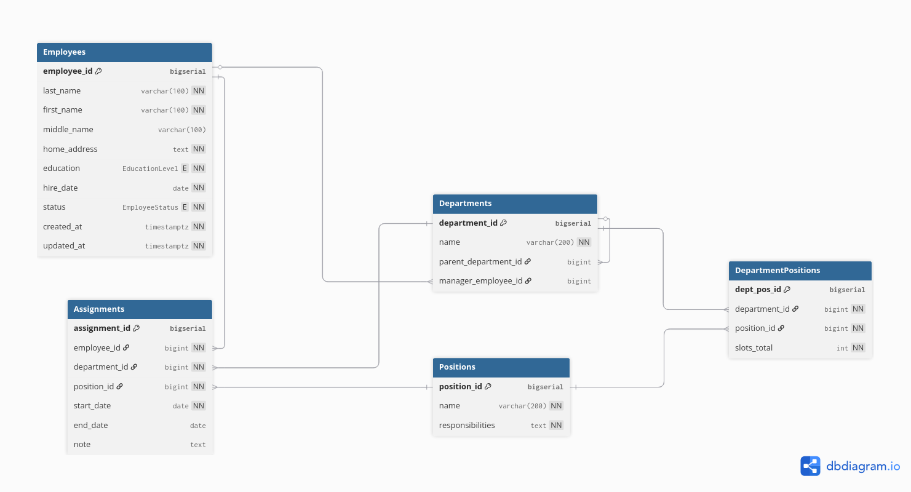

# Система информации о персонале компании

Сайт с заданием: [главная страница](https://sites.google.com/view/wtpractice/home)

## Получение шаблона для проекта

Шаблон проекта отсюда: [Spring IO](start.spring.io)

> [!NOTE]  
> ToDo: Add the screenshot

## Как запустить?

```bash
# sudo pacman -S jdk21-openjdk postgresql

sudo docker compose up -d --build

sudo docker exec -it devshell_container bash

./gradlew dbCreate
./gradlew dbInit
./gradlew dbDump
./gradlew dbClean

./gradlew -PdbName=postgres -PdbUser=postgres -PdbPassword=password dbInit
./gradlew -PdbSchema=hr -PdumpFile=build/out.txt dbDump
```

## Страницы (переходы и кнопки)

### Схема

> [!NOTE]  
> ToDo

Все страницы имеют кнопку:

* назад на главную
* назад на предыдущую страницу

### 1) Главная страница

**Переходы:**

* **Все служащие**
* **Все подразделения**
* **Все должности**
* **Граф подразделений**
* **Форма добавления служащего**
* **Форма добавления подразделения**
* **Форма добавления должности**

**Кнопки:**

* **Поиск**

### 2) Все служащие

* Фильтры / сортировки: **по подразделению**, **по сроку работы**, **по должности**
* Поиск по ФИО

**Колонки таблицы:**

1. **ID** (`employee_id`) --- опционально, удобно для отладки / ссылок или ИНН, что-то такое
2. **ФИО** --- кликабельно, переводит на карточку сотрудника
3. **Подразделение (текущее)** --- кликабельно, переводит на карточку подразделения
4. **Должность (текущая)** --- кликабельно, переводит на карточку должности
5. **Дата приёма** (`hire_date`)
6. **Стаж** (`now() - hire_date`) --- вычисляемое поле
7. **Статус** --- Работает / Уволен

**Переходы:**

* **Персональная (карточка) служащего**
* **Форма добавления служащего**

**Кнопки:**

* Поиск
* Фильтры
* Сортировки

### 3) Карточка служащего

**Поля:**

* ФИО
* Домашний адрес
* Образование
* Срок работы в компании
* Текущая должность + подразделение

**Переходы:**

* **История служащего**

**Кнопки:**

* **Редактировать**
* **Сохранить**
* **Удалить**
* **Отменить**

### 4) История служащего

**Переходы:**

* **Карточка служащего**
* **Карточка должности**
* **Карточка подразделения**

### 5) Все подразделения

1. **ID** (`department_id`) --- опционально
2. **Название** (`name`) --- кликабельно, переводит на карточку подразделения
3. **Головное подразделение** (`parent_department_name`, вычислимо) --- если `NULL` -> корневое; кликабельно, переводит на карточку подразделения
4. **Руководитель** (`manager_employee_id` -> `Employees`) --- если `NULL` -> не назначен; кликабельно, переводит на карточку сотрудника
5. **Количество внутренних подразделений** (`Departments where parent_department_id = <this>`) --- количество прямых "детей" в графе (см. описание там)
6. **Количество сотрудников (активных)** (`Assignments where department_id = this and end_date IS NULL`)

**Переходы:**

* **Карточка подразделения**
* **Карточка сотрудника**

### 6) Карточка подразделения

**Поля:**

* Название
* Руководитель (ссылка на карточку служащего)
* Головное подразделение
* Внутренние подразделения (список/дерево)
* Должности в подразделении (с количеством позиций) + кто занимает

**Кнопки:**

* **Редактировать**
* **Сохранить**
* **Удалить**

### 7) Все должности

1. **ID** (`position_id`) --- (опционально)
2. **Название должности** (`Positions.name`) --- кликабельно, переводит на карточку должности
3. **Краткое описание** (`responsibilities`) --- обрежу до N символов, например 80–120
4. **Сколько подразделений использует** (сколько `DepartmentPositions` содержит эту должность, вычислимо) --- в целом не очень важно
5. **Сколько сотрудников назначено (активно)** (`Assignments where position_id = this and end_date IS NULL`, вычислимо)

**Переходы:**

* **Карточка должности**
* **Форма добавления должности**

### 8) Карточка должности

**Поля:**

* Подразделение
* Должность
* Дата назначения
* Проверка наличия свободной позиции

**Кнопки:**

* **Редактировать**
* **Сохранить**
* **Удалить**

### 9) Граф подразделений

### Назначение страницы

Визуально показать **иерархию подразделений** и, как следствие, дать быстрый переход в карточки.

*Самое сложное тут: построить граф так, чтобы он был максимально планарен. Надеюсь, есть готовые решения!*

### Что отображается?

**Граф (дерево):**

* **Узлы / вершины**          --- подразделения из `Departments`.
* **Рёбра**                   --- связь `parent_department_id` -> `department_id`.
* **Корневые узлы / вершины** --- подразделения, у которых `parent_department_id IS NULL`.

**Содержимое узла (карточки узла на графе):**

1. **Название подразделения**   (кликабельно, перекидывает на карточку подразделения)
2. **Руководитель** (если есть) (кликабельно --- карточка сотрудника)
3. **Сводка чисел**:

   * Количество **сотрудников (активных)** в подразделении
   * Количество **внутренних подразделений** (то есть количество прямых детей в графе)

**Управление графом:**

* **Панорамирование / перемещение** (drag)
* **Масштабирование** (zoom: кнопки +/− и / или колесо мыши)
* **Свернуть / развернуть ветку** (по клику на узел или отдельной кнопкой на узле)
* **Кнопка "Добавить подразделение"** (переход на форму добавления)

**Переходы:**

* **Карточка подразделения**
* **Карточка сотрудника**
* **Форма добавления подразделения**

### 10) Форма добавления служащего

**Кнопки:**

* **Сохранить**
* **Отменить**

### 11) Форма добавления подразделения

**Кнопки:**

* **Сохранить**
* **Отменить**

### 12) Форма добавления должности

**Кнопки:**

* **Сохранить**
* **Отменить**

## Сценарии использования

### Добавление служащего

* Перейти на главную страницу
* Нажать "Добавить служащего"
* Заполнить необходимые поля
* Подтвердить добавление в базе данных

### Назначение служащего на новую должность

* Перейти на персональную страницу сотрудника
* Нажать "Назначить на новую должность"
* Выбрать подразделение и должность
* Подтвердить изменения
* Информация автоматически добавляется в историю

### Просмотр структуры подразделений

* Перейти на главную страницу
* Открыть "Структура компании"
* Выбрать нужное подразделение
* Просмотреть его состав, должности и сотрудников

### Получение списка сотрудников

* Перейти на главную страницу
* Открыть список служащих

  * Отсортировать по ФИО или сроку работы
  * Отфильтровать по подразделению или должности
* Перейти на персональную страницу нужного сотрудника

### Поиск служащего по ФИО

* Перейти на главную страницу
* Ввести ФИО в строку поиска
* При совпадении фамилий можно уточнить сотрудника по сроку работы или подразделению
* Перейти на персональную страницу сотрудника

# База данных

## DBML

Нарисовано тут: [DBDiagram IO](dbdiagram.io)

```dbml
Project HR_Personnel_System {
  database_type: "PostgreSQL"
  note: "OLTP-схема для системы управления персоналом: сотрудники, подразделения (иерархия), должности, штатные позиции и история назначений. Включены enum-типы и частичный уникальный индекс для активного назначения."
}

Enum EmployeeStatus {
  ACTIVE
  INACTIVE
}

Enum EducationLevel {
  SECONDARY
  VOCATIONAL
  BACHELOR
  MASTER
  PHD
}

Table Employees {
  employee_id   bigserial [pk]
  last_name     varchar(100) [not null]
  first_name    varchar(100) [not null]
  middle_name   varchar(100)
  home_address  text [not null]
  education     EducationLevel [not null, note: "Уровень образования (enum)"]
  hire_date     date [not null, note: "Дата приёма на работу (для расчёта стажа)"]
  status        EmployeeStatus [not null, default: "ACTIVE", note: "Статус сотрудника (soft delete через INACTIVE)"]
  created_at    timestamptz [not null, default: "now()"]
  updated_at    timestamptz [not null, default: "now()"]

  Indexes {
    (last_name, first_name) [name: "idx_employees_last_first", note: "Поиск по ФИО"]
  }

  Note: "Справочник сотрудников. История должностей хранится в Assignments."
}

Table Departments {
  department_id        bigserial [pk]
  name                 varchar(200) [not null, unique]
  parent_department_id bigint [ref: > Departments.department_id, note: "Головное подразделение; NULL = корневое"]
  manager_employee_id  bigint [ref: > Employees.employee_id, note: "Руководитель подразделения; может быть NULL"]

  Note: "Подразделения компании. Иерархия через parent_department_id."
}

Table Positions {
  position_id      bigserial [pk]
  name             varchar(200) [not null, unique]
  responsibilities text [not null]

  Note: "Справочник должностей."
}

Table DepartmentPositions {
  dept_pos_id   bigserial [pk]
  department_id bigint [not null, ref: > Departments.department_id]
  position_id   bigint [not null, ref: > Positions.position_id]
  slots_total   int [not null, note: "Количество ставок (>=0)"]

  Indexes {
    (department_id, position_id) [name: "uq_deptpos_unique", unique, note: "Одна должность в штате подразделения — одной строкой"]
  }

  Note: "Штатное расписание: должность + количество позиций в подразделении. Занятость определяется по активным Assignments."
}

Table Assignments {
  assignment_id bigserial [pk]
  employee_id   bigint [not null, ref: > Employees.employee_id]
  department_id bigint [not null, ref: > Departments.department_id]
  position_id   bigint [not null, ref: > Positions.position_id]
  start_date    date [not null]
  end_date      date [note: "NULL = активное (текущее) назначение"]
  note          text

  Indexes {
    (employee_id) [name: "uq_active_assignment_per_employee", unique, note: "Частичный UNIQUE WHERE end_date IS NULL (1 активное назначение на сотрудника)"]
    (department_id) [name: "idx_assignments_department"]
    (position_id) [name: "idx_assignments_position"]
    (employee_id, start_date) [name: "idx_assignments_employee_dates", note: "История назначений по сотруднику (start_date DESC в БД)"]
  }

  Note: "История назначений сотрудников на должности в подразделениях. CHECK: end_date IS NULL OR end_date >= start_date."
}
```

## Схема



