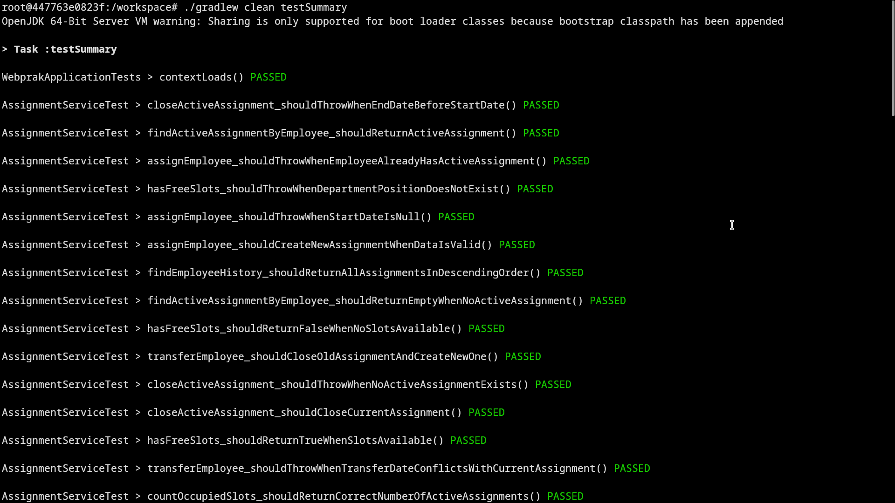
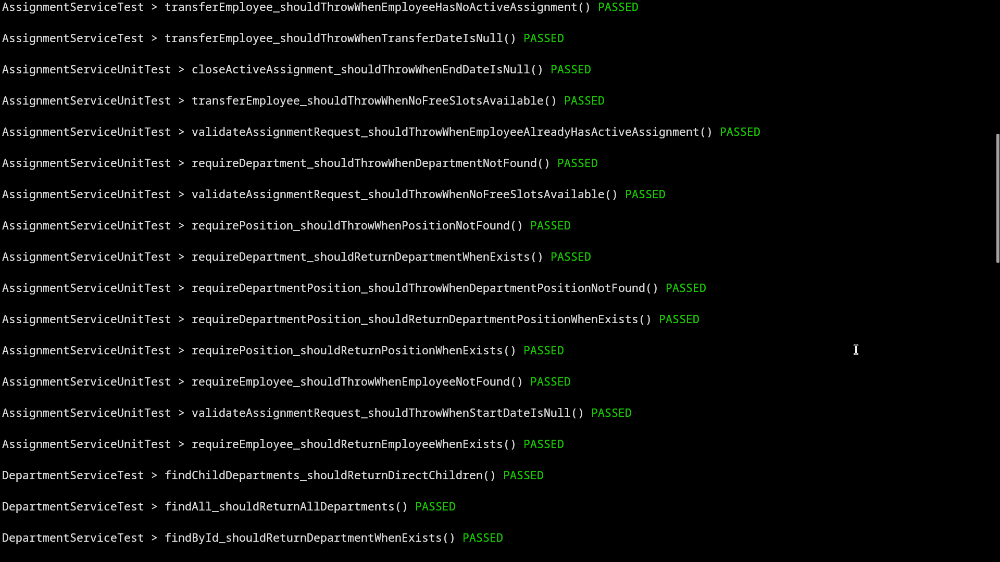
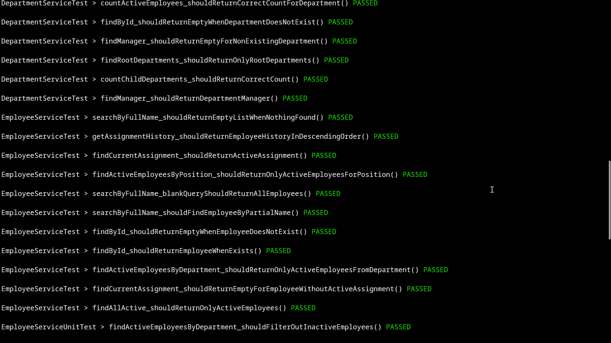
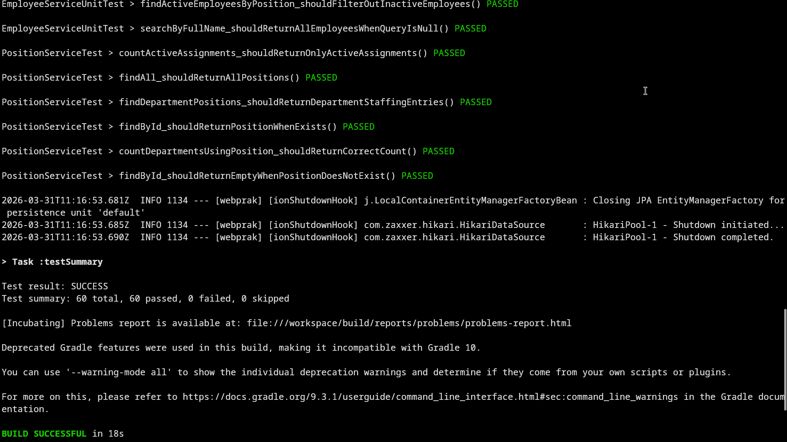
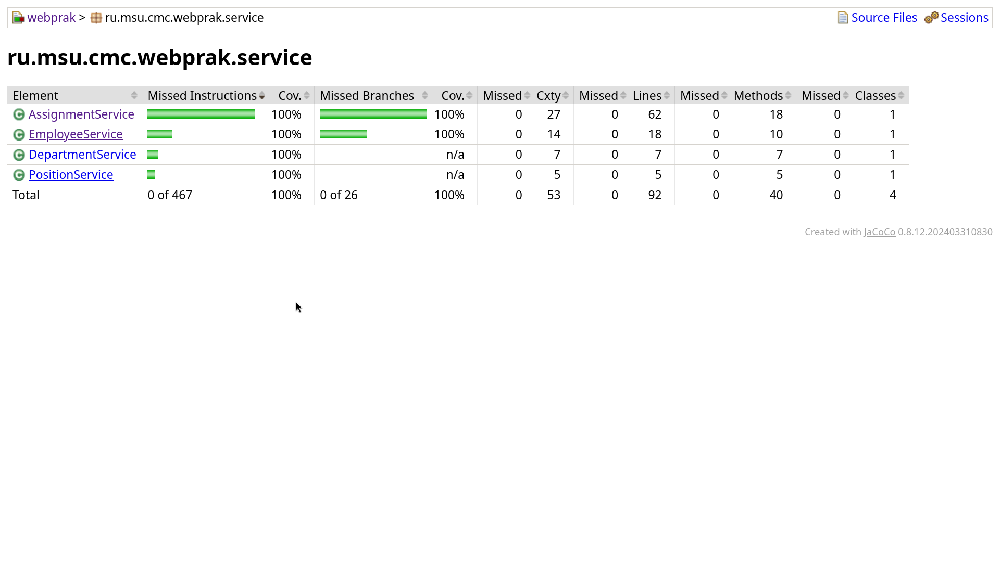

# Второй отчет

## Тесты service-методов

### Как запускать?

```bash
./gradlew clean test
./gradlew clean testVerbose
./gradlew clean testSummary
```

### Результаты выполнения тестов









## Покрытие service-методов

### Как запускать?

```bash
./gradlew coverage
./gradlew clean test jacocoTestReport
```

### Результаты покрытия


